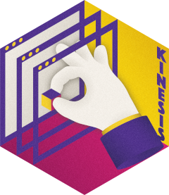

<!-- README.md is generated from README.Rmd. Please edit that file -->

# kinesis 

<!-- badges: start -->

<a href="https://ci.codeberg.org/repos/14694" class="pkgdown-devel"></a>
<a href="https://packages.tesselle.org/kinesis/coverage/"
class="pkgdown-devel"></a>
<a href="https://cran.r-project.org/package=kinesis"
class="pkgdown-devel"></a>

<a href="https://tesselle.r-universe.dev/kinesis"
class="pkgdown-devel"></a>
<a href="https://cran.r-project.org/package=kinesis"
class="pkgdown-release"></a> <a
href="https://cran.r-project.org/web/checks/check_results_kinesis.html"
class="pkgdown-release"></a>
<a href="https://cran.r-project.org/package=kinesis"
class="pkgdown-release"></a>

[](https://www.repostatus.org/#wip)

[](https://doi.org/10.5281/zenodo.14645671)
<!-- badges: end -->

## Overview

A collection of [**shiny**](https://shiny.posit.co) applications that
provides graphical user interfaces for the
[tesselle](https://www.tesselle.org) packages.

This package is currently *experimental*. This means that it is
functional, but interfaces and functionalities may change over time,
testing and documentation may be lacking.

------------------------------------------------------------------------

To cite kinesis in publications use:

Frerebeau N (2024). “The tesselle Project: a Collection of R Packages
for Research and Teaching in Archaeology.” *Advances in Archaeological
Practice*, *12*(4), 424-430. <doi:10.1017/aap.2024.10>
<https://doi.org/10.1017/aap.2024.10>.

Frerebeau N (2025). *kinesis: ‘shiny’ Applications for the ‘tesselle’
Packages*. Université Bordeaux Montaigne, Pessac, France.
<doi:10.5281/zenodo.14645671> <https://doi.org/10.5281/zenodo.14645671>,
R package version 0.3.0, <https://packages.tesselle.org/kinesis/>.

This package is a part of the tesselle project
<https://www.tesselle.org>.

## Remote use

The applications are deployed on <https://shiny.archaeo.science>.

## Local use

### Installation

You can install the released version of **kinesis** from
[CRAN](https://CRAN.R-project.org) with:

``` r
install.packages("kinesis")
```

And the development version from [Codeberg](https://codeberg.org/) with:

``` r
# install.packages("remotes")
remotes::install_git("https://codeberg.org/tesselle/kinesis")
```

### Usage

``` r
## Load the package
library(kinesis)

## Run the app for matrix seriation
run_app("seriation")
```

| Keyword     | Application name              |
|:------------|:------------------------------|
| `aoristic`  | Aoristic Analysis             |
| `ca`        | Correspondence Analysis       |
| `pca`       | Principal Components Analysis |
| `diversity` | Diversity Measures            |
| `mcd`       | Mean Ceramic Date             |
| `scatter`   | Scatter Plot                  |
| `seriation` | Matrix Seriation              |
| `source`    | Compositional Data Analysis   |
| `ternary`   | Ternary Plot                  |

### Asynchronous backend

``` r
## Run app using 3 local daemons
# install.packages("mirai")
obj <- run_app("seriation")
with(mirai::daemons(3), shiny::runApp(obj))
```

## Translation

This package provides translations of the user interface. The preferred
language is by default taken from the locale. This can be overridden by
setting of the environment variable `LANGUAGE` (you only need to do this
once per session):

``` r
Sys.setenv(LANGUAGE = "<language code>")
```

Languages currently available are English (`en`) and French (`fr`).

## Contributing

Please note that the **kinesis** project is released with a [Contributor
Code of Conduct](https://www.tesselle.org/conduct.html). By contributing
to this project, you agree to abide by its terms.
